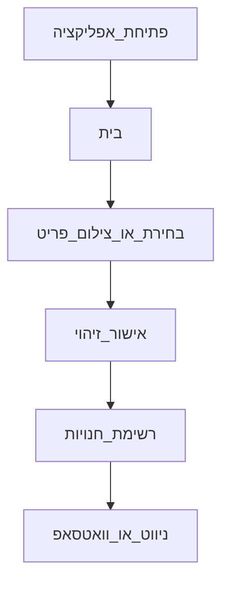

# StyleNear — אפיון UX (User Flow + Wireframes)

> מסמך משלים ל־[`mvp.md`](./mvp.md). מתאר את מסלול המשתמש והמסכים של גרסת ה־MVP בלבד.

## 1. User Flow — המסלול המרכזי (Happy path)



### מסלולים משניים (עדיין ב־MVP)

| מסלול | מתי | לאן |
|--------|-----|-----|
| הגדרת מידה/אזור | פעם ראשונה או שינוי | פרופיל / אזור → חזרה לבית |
| עגלה | אחרי הלבשת כמה פריטים | רשימת פריטים → “מצא לידך” לפריט |
| היסטוריה | חזרה לחיפוש קודם | אופציונלי ב־v1; לא חוסם |

### מה אסור לשבור בזרימה

- אחרי בחירת פריט — תמיד אפשר להגיע ל־“מצא לידך” בלי יותר מ־2 הקשות.
- מסך החנויות תמיד מציג קודם חנויות **עם המידה שלי**.
- אין מסכי ביניים שיווקיים (SALE כמסך נפרד, קולקציות דקורטיביות) על המסלול הראשי.

---

## 2. מפת מסכים ל־MVP

| מסך | קובץ בקוד (אם קיים) | חובה ב־v1? |
|-----|---------------------|------------|
| בית | `app/(tabs)/index.tsx` | כן |
| ניתוח פריט | `app/analysis.tsx` | כן |
| חנויות קרובות | `app/stores.tsx` | כן |
| פרופיל / בובה בסיסית | `app/(tabs)/avatar.tsx` | כן (מידה + דמות) |
| אזור | `app/area.tsx` | כן |
| עגלה | `app/cart.tsx` | משני |
| היסטוריה | `app/(tabs)/history.tsx` | אופציונלי |

---

## 3. Wireframes (סקיצות טקסט)

### 3.1 בית

**מטרה אחת:** לבחור פריט ולהתחיל חיפוש מלאי.

```
┌─────────────────────────────────┐
│  [אזור] [פרופיל] [עגלה]  חיפוש  │
│              StyleNear          │
├─────────────────────────────────┤
│                                 │
│         [ בובה פשוטה ]          │
│      בחירת גיל/מין (אופציונלי)  │
│                                 │
│     [ מצא לידך ]  [ עריכה ]     │
├─────────────────────────────────┤
│     [ צילום ]   [ גלריה ]       │
├─────────────────────────────────┤
│   מוצרים להלבשה מהירה (אופצ.)   │
└─────────────────────────────────┘
```

| חובה | לא לשים |
|------|---------|
| חיפוש, כניסה לצילום/גלריה, CTA מצא לידך | ניווט באנגלית (Home/Collections…) |
| תצוגת מידה קבועה / אזור נוכחי | באנרים SALE כמסך ראשי |
| | סואצ׳ים וציורים דקורטיביים על הגיבור |

---

### 3.2 ניתוח פריט

**מטרה אחת:** לאשר שהזיהוי נכון לפני חיפוש חנויות.

```
┌─────────────────────────────────┐
│           ניתוח הבגד            │
├─────────────────────────────────┤
│        [ תמונת הפריט ]          │
│                                 │
│  קטגוריה: מכנסיים               │
│  צבע: כחול                      │
│  מידה לחיפוש: [ M ▼ ]           │
│                                 │
│      [ מצא לידך → ]             │
└─────────────────────────────────┘
```

| חובה | לא לשים |
|------|---------|
| סיכום זיהוי קריא בעברית | יותר מדי מדדי AI / אחוזים מבלבלים |
| שינוי מידה לפני חיפוש | כפתורי שיתוף / לייק |

---

### 3.3 חנויות קרובות

**מטרה אחת:** לבחור חנות עם המידה ולצאת לדרך / ליצור קשר.

```
┌─────────────────────────────────┐
│     מלאי קרוב · גרנד קניון      │
│  [ רק מידה שלי ]  מידה: M       │
├─────────────────────────────────┤
│ ★ Castro · 0.4 ק״מ              │
│   יש M · ₪249 · בוטיק?          │
│   [ נווט עכשיו ] [ וואטסאפ ]    │
├─────────────────────────────────┤
│   Zara · 0.5 ק״מ                │
│   אין M · מידות: S L            │
│   [ ניווט ]                     │
└─────────────────────────────────┘
```

| חובה | לא לשים |
|------|---------|
| מרחק, מידות, האם יש את המידה שלי | מפה מורכבת כברירת מחדל ב־web |
| CTA ניווט ברור | סינון יתר שלא קשור למידה/מרחק |
| (MVP+) WhatsApp | תשלום / הוספה לסל אונליין |

---

### 3.4 פרופיל קצר (מידה + דמות)

**מטרה אחת:** לשמור מידה קבועה (ודמות בסיסית אם משתמשים בבובה).

```
┌─────────────────────────────────┐
│         הפרופיל שלי             │
├─────────────────────────────────┤
│  מידה קבועה:  [ XS S M L XL ]   │
│  אזור:        גרנד קניון    ›   │
│  דמות:        אישה / גבר / …    │
│                                 │
│      [ שמירת הפרופיל ]          │
└─────────────────────────────────┘
```

---

### 3.5 אזור

**מטרה אחת:** לבחור איפה לחפש מלאי בפיילוט.

```
┌─────────────────────────────────┐
│         בחירת אזור              │
├─────────────────────────────────┤
│  ✓ גרנד קניון · קניון           │
│    נאות פרס · שכונה             │
│    הדר · מרכז                   │
│    כל חיפה · פיילוט מלא         │
└─────────────────────────────────┘
```

---

### 3.6 עגלה (משני)

**מטרה אחת:** לראות פריטים שלבשתי על הבובה ולחפש מלאי לפריט.

```
┌─────────────────────────────────┐
│         עגלת קניות              │
├─────────────────────────────────┤
│  שמלה חומה · מידה L             │
│  [ מצא לידך ]        [ מחק ]    │
├─────────────────────────────────┤
│  (ריק) → חזרה לבית להלבשה       │
└─────────────────────────────────┘
```

> זו לא עגלת תשלום — זו רשימת פריטים לחיפוש מלאי בחנויות.

---

## 4. עקרונות UX ל־StyleNear

1. **מסך = מטרה אחת** + כותרת אחת + משפט תומך קצר.
2. **CTA ראשי אחד** בכל מסך (בדרך כלל “מצא לידך” / “נווט עכשיו”).
3. **RTL ועברית** בכל הטקסטים; בלי תוויות באנגלית בממשק.
4. **מידה בולטת** בכל שלב אחרי בחירת פריט.
5. **פחות קישוטים** — בלי ציורים דקורטיביים על הגיבור ובלי ניווט מיותר.

## 5. קשר לקבצים בקוד

| רכיב UX | קובץ |
|---------|------|
| בית + כותרת | `src/app/(tabs)/index.tsx`, `src/components/SiteHeader.tsx` |
| בובה | `src/components/HeroAvatarSection.tsx`, `DressableFigure.tsx` |
| חנויות | `src/app/stores.tsx`, `src/components/StoreCard.tsx` |
| מחרוזות עברית | `src/i18n/he.ts` |
| הגדרת מוצר | [`mvp.md`](./mvp.md) |
